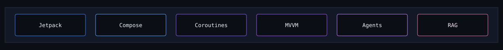
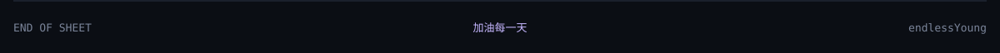

  

 

   Microsoft
  &ensp;·&ensp;
   Android
  &ensp;·&ensp;
   Compose
  &ensp;·&ensp;
   TypeScript
  &ensp;·&ensp;
   AI Agents

<table>
<tr>
<td width="50%" valign="top">

###  Quick Highlights

|                                                                                                                                 |                                              |
|---------------------------------------------------------------------------------------------------------------------------------|----------------------------------------------|
|            | **Software Engineer** @ **Microsoft**        |
|             | **300+ notes** on Android / Kotlin / AI      |
|            | **Android Framework** & **Jetpack Compose**  |
|  | Open-source **AI skills** & editor cores     |
|               | Frontend: **React**, **Vue**, **TypeScript** |
|           | Exploring **Agents**, **RAG**, and tooling   |

</td>
<td width="50%" valign="top">

###  Current Focus

-  **Architecture visualization** as an AI skill
-  **Android Framework / Compose** deep dives
-  High-performance **Markdown** tooling
-  **Agent / RAG** workflows in real projects

###  Top Languages

</td>
</tr>
</table>

##  Connect

  <table>
    <tr>
      <td align="center" width="120">
        <a href="https://github.com/endlessYoung">
           
          GitHub
        </a>
      </td>
      <td align="center" width="120">
        <a href="https://endlessyoung.github.io/Blog_/">
           
          Blog
        </a>
      </td>
      <td align="center" width="120">
        <a href="https://github.com/endlessYoung?tab=repositories">
           
          Repos
        </a>
      </td>
    </tr>
  </table>

##  Featured Work

<table>
<tr>
<td width="50%" valign="top">

###  visual-architecture
<a href="https://github.com/endlessYoung/visual-architecture"> View repo</a>
&nbsp;
 [stars](https://github.com/endlessYoung/visual-architecture/stargazers)

AI Skill that turns technical descriptions into verifiable **HTML + SVG** architecture diagrams — interview-style grilling, design systems, PNG export.

**Tech:** `JavaScript` `SVG` `AI Skill` `Design Systems`

</td>
<td width="50%" valign="top">

###  Endlessyoung's Blog
<a href="https://endlessyoung.github.io/Blog_/"> Read blog</a>
&nbsp;
<a href="https://github.com/endlessYoung/Blog_"> View repo</a>

Personal notes on **Android Framework**, Compose, Kotlin, Java, and AI Agents. Built with VitePress, continuously updated.

**Tech:** `VitePress` `Android` `Kotlin` `Agents`

</td>
</tr>
<tr>
<td width="50%" valign="top">

###  FluxMD
<a href="https://github.com/endlessYoung/flux-md-editor"> View repo</a>

Universal, high-performance **Markdown editor core** for React and Vue — one engine, two ecosystems.

**Tech:** `TypeScript` `React` `Vue` `Markdown`

</td>
<td width="50%" valign="top">

###  img2points
<a href="https://github.com/endlessYoung/img2points"> View repo</a>

Turn a photo into deterministic **pointillism / bead-art** as SVG and PNG.

**Tech:** `TypeScript` `SVG` `Image Processing`

</td>
</tr>
<tr>
<td width="50%" valign="top">

###  OmniType
<a href="https://github.com/endlessYoung/OmniType"> View repo</a>

Cross-platform **Markdown typesetting** — give every draft a consistent, professional look.

**Tech:** `JavaScript` `Markdown` `Typography`

</td>
<td width="50%" valign="top">

###  MySavings
<a href="https://github.com/endlessYoung/MySavings"> View repo</a>

Personal savings tracker on **Android / Kotlin**.

**Tech:** `Kotlin` `Android` `Jetpack`

</td>
</tr>
<tr>
<td colspan="2" align="center">

###  More
<a href="https://github.com/endlessYoung?tab=repositories"> View all repos</a>

Also shipping **InjectAI**, **visual-roadmap**, **quilt**, and Clash Verge theme packs.

**Areas:** `Android` `AI Skills` `Editors` `Visualization`

</td>
</tr>
</table>

##  Tech Stack

<table>
  <tr>
    <td align="center" width="96">
       Android
    </td>
    <td align="center" width="96">
       Kotlin
    </td>
    <td align="center" width="96">
       Java
    </td>
    <td align="center" width="96">
       TypeScript
    </td>
    <td align="center" width="96">
       JavaScript
    </td>
    <td align="center" width="96">
       React
    </td>
    <td align="center" width="96">
       Vue
    </td>
  </tr>
  <tr>
    <td align="center" width="96">
       Python
    </td>
    <td align="center" width="96">
       Node.js
    </td>
    <td align="center" width="96">
       Vite
    </td>
    <td align="center" width="96">
       Tailwind
    </td>
    <td align="center" width="96">
       Linux
    </td>
    <td align="center" width="96">
       Git
    </td>
    <td align="center" width="96">
       GitHub
    </td>
  </tr>
  <tr>
    <td align="center" width="96">
       VS Code
    </td>
    <td align="center" width="96">
       IntelliJ
    </td>
    <td align="center" width="96">
       Gradle
    </td>
    <td align="center" width="96">
       SQLite
    </td>
    <td align="center" width="96">
       Postman
    </td>
    <td align="center" width="96">
       Docker
    </td>
    <td align="center" width="96">
       Figma
    </td>
  </tr>
</table>

 

##  GitHub Statistics

 

  

##  Writing

<a href="https://endlessyoung.github.io/Blog_/">
   300+ Technical Notes
</a>
&ensp;·&ensp;
<a href="https://endlessyoung.github.io/Blog_/Android/Activity">
   Android Framework
</a>
&ensp;·&ensp;
<a href="https://endlessyoung.github.io/Blog_/">
   Agents & ML
</a>

  

 **Android / Compose / Framework** notes — AMS, WMS, Binder, performance

 

 **AI & Agents** — RAG, workflows, and hands-on experiments

 

 **Java / Kotlin** — concurrency, JVM, coroutines, Flow

  

